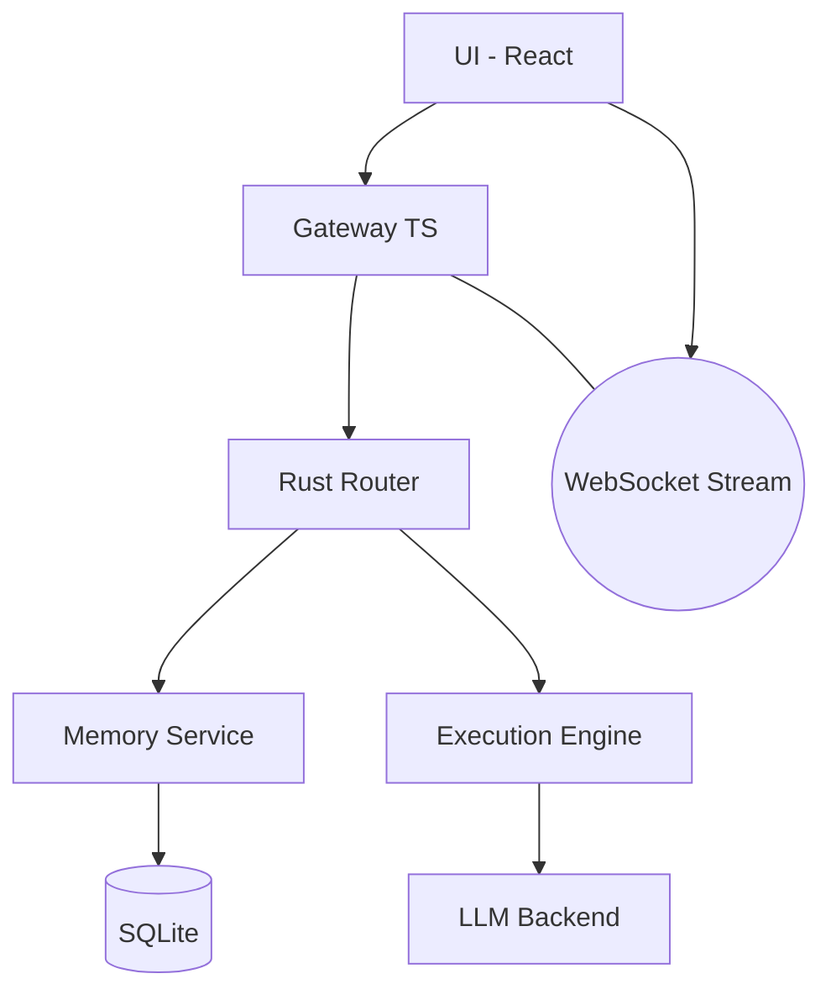
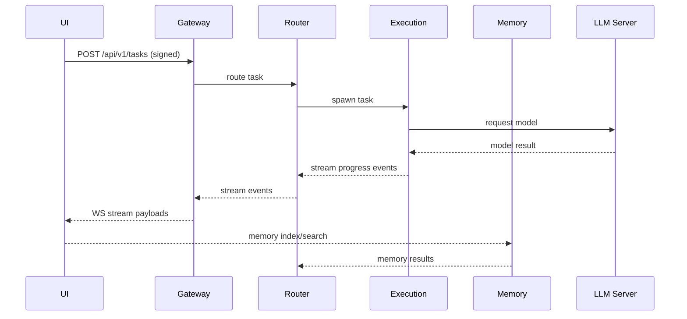
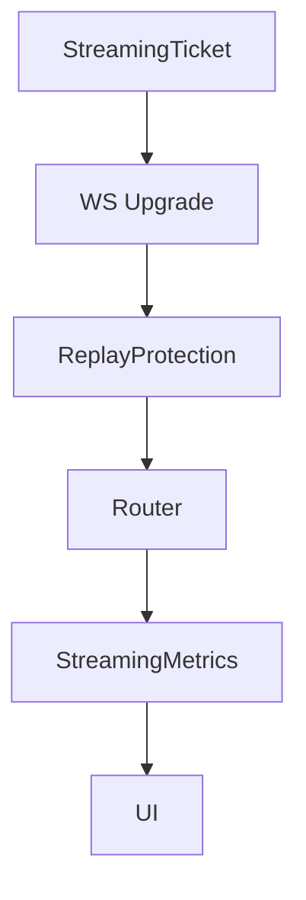

# Architecture Overview — APEX/OpenFang Integration MVP

This document captures the high-level and detailed architecture of the APEX/OpenFang integration MVP as implemented in the current codebase. It describes components, data flows, and responsibilities, and lays out a concrete plan for onboarding and future evolution.

Table of contents
- System context and design goals
- Core components and their responsibilities
- Data flows (end-to-end scenarios)
- Interfaces and protocols
- Architectural decisions and trade-offs
- Non-functional considerations
- TODOs and next steps
- Architecture schematic (ASCII)
- Progress log

1) System context and design goals
- Goal: Provide a secure, streaming-enabled, highly extensible agent execution platform combining OpenClaw-like gateway, Hermes-style memory, and streaming analytics.
- Stakeholders: End users, developers, operators.
- Key quality goals: security, reliability, observability, modularity, and testability.

2) Core components and responsibilities
- L1 Gateway (TypeScript)
  - Responsibilities: Signed HTTP requests to the Rust router, HMAC signing/verification, API surface for UI and services, streaming client abstraction (WS/SSE), feature flags and routing glue for UI.
- L2-L3 Core (Rust)
  - Router: HTTP endpoints for tasks, skills, memory, streams, and system info.
  - Execution Engine: Spawns sandboxes/VMs for task execution, coordinates with LLM backend.
  - Memory Service: SQLite-based storage with Hermes features (bounded memory integration, session search).
  - Streaming subsystem: Manages StreamingTickets, WS endpoints, SSE endpoints, and streaming events mapping to ExecutionEvents.
  - Replay Protection: In-memory and Redis backends to prevent replay through streaming channels.
  - Streaming Analytics: Metrics collection for active connections, events counts, errors; exposes /stream/stats.
- L4 Skills (TypeScript)
  - Loader framework for skills, schemas via zod, and health checks.
- L5 Execution (Python)
  - Secure sandbox environment that runs agent loops and commands.
- L6 UI (React)
  - Real-time UI with chat, Kanban, streaming UI and settings; WebSocket-based streams to the router; uses Zustand store.
- Adapters (Slack/Discord/etc.)
  - Gateway adapters for external channels.

3) Data flows (end-to-end scenarios)
- Scenario A — Create a task and stream results
  1) User interacts with UI (Chat/Board) → 2) UI uses WS/SSE to subscribe to stream events → 3) UI creates a task via signed API to Gateway → 4) Gateway signs request and forwards to Rust Router → 5) Router classifies task and dispatches to the Execution Engine → 6) Execution Engine communicates with LLM and/or Memory; streams progress back → 7) Streaming subsystem funnels events to open WebSocket/SSE streams and to UI; 8) UI renders streaming events in real time.
- Scenario B — Streaming analytics and replay protection
  1) StreamingTicket is created with HMAC; UI obtains a ticket; 2) WS upgrade occurs with ticket; 3) Streaming Metrics increment counters via atomic ops; 4) Replay Protection ensures no duplicates; 5) Metrics can be read via /stream/stats; 6) If disconnection occurs, resources are cleaned up and metrics updated.
- Scenario C — Memory and Leverage of Hermes features
  1) User actions cause memory entries to be stored, queries to search, or knowledge to be bounded. 2) Memory Service indexes and persists data. 3) Session search uses BM25 ranking for relevant results.

4) Interfaces and protocols
- HTTP: REST API between Gateway and Router; HMAC-signed requests.
- WebSocket and SSE: Streaming channel for events; ticket-based authentication for WS.
- Data models: Task, ExecutionEvent, StreamingTicket, StreamingMetrics, ReplayProtection.
- Config: Unified AppConfig via core/router unified_config.rs; per-request State<AppState>.

5) Architectural decisions and trade-offs
- Security-first posture with HMAC, TOTP, and isolated execution; trade-offs include added complexity in request signing and auditing.
- Streaming design emphasizes low-latency real-time feedback; this increases complexity in coordinating WS/SSE and replay protection.
- Hermes memory integration enables robust memory-backed features but increases system coupling; design focus on clear ownership boundaries.
- Redis-based replay backend is optional; trade-off: operational complexity vs scalability.

6) Non-functional considerations
- Performance: lock granularity, futures and streams correctness; potential contention on shared state in hot paths.
- Reliability: WS/SSE reconnection, heartbeat patterns, and ping/pong strategies.
- Security: Avoid leaking secrets in logs; constant-time comparisons; proper handling of tickets.
- Observability: Metrics per streaming path; structured logging and correlation IDs.

7) TODOs and next steps
- [ ] Draft a consolidated architecture diagram (draw.io or Mermaid) and embed in repository.
- [ ] Create a dedicated Architecture section in README linking to ARCHITECTURE_APEX.md.
- [ ] Add a formal Architecture Review milestone in the Kanban board.
- [ ] Normalize data models and naming conventions across languages.
- [ ] Produce a small, side-by-side comparison of streaming APIs (WS vs SSE) with recommended usage.
- [ ] Introduce a lightweight sequence diagram per major feature to accompany docs.

8) Architecture schematic (ASCII)

System block diagram (high level):

UI (React) <-> Gateway (TS, signed API) <-> Router (Rust) <-> LLM / Execution Engine / Memory
   |                          |                 |              |             |
   |--------- Streaming --------------|  Streams       |             |  Bound Memory
   |                                 |  Ticketing     |             |
   v                                 v                v             v
 Notification/Adapters           Replay Protection   Streaming analytics

Horizontal dataflows and dependencies are left to follow the detailed data flow steps above.

9) Architecture diagrams (Mermaid)

### 9.1 System diagram (Mermaid)

### 9.2 Streaming data flow (Mermaid sequenceDiagram)

### 9.3 Replay protection and analytics (Mermaid)

### 9.4 Detailed sequence flows (expandable)
- Scenario A: Create task and streaming results (UI -> Gateway -> Router -> Engine -> LLM -> Streaming -> UI)
- Scenario B: Streaming analytics and replay protection (ticket creation, upgrade, protect, metrics, read stats)
- Scenario C: Hermes memory indexing and BM25 search (UI/Router/Memory/Query)

10) Progress log
- Draft created for Code Quality Review and Architecture documentation.
- Next steps: iterate with code samples, gather feedback from stakeholders, and incorporate into CI gates.
- Draft created for Code Quality Review and Architecture documentation.
- Next steps: iterate with code samples, gather feedback from stakeholders, and incorporate into CI gates.
